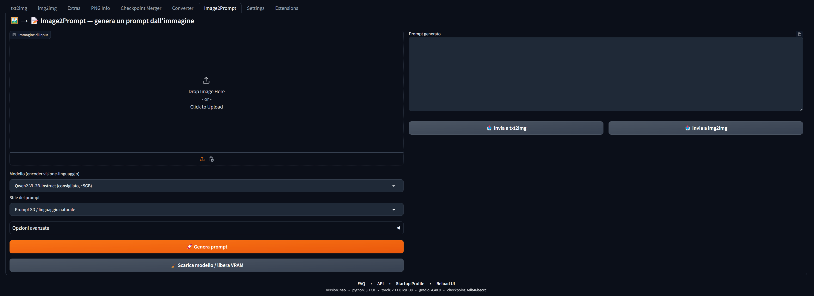

# Image2Prompt — Extension for SD WebUI Forge Neo

Extra **Image2Prompt** tab: upload an image and generate a text prompt using a vision-language encoder (**Qwen2-VL / Qwen2.5-VL** or **Florence-2**). The generated prompt can be sent to txt2img or img2img with one click.

> ⚠️ **Note:** On first run, the selected model is downloaded from Hugging Face (several GB). Models are cached in `~/.cache/huggingface` by default.

## Features

- 📤 Upload image (or paste from clipboard)
- 🧠 Selectable models:
  - `Qwen/Qwen2-VL-2B-Instruct` — recommended, good quality/VRAM balance (~5 GB)
  - `Qwen/Qwen2.5-VL-3B-Instruct` — better quality (~7 GB, requires transformers ≥ 4.49)
  - `Qwen/Qwen2-VL-7B-Instruct` — maximum quality (~16 GB)
  - `microsoft/Florence-2-base` / `Florence-2-large` — lightweight, caption only
- ✍️ Output styles: natural SD prompt, Danbooru-style tags, detailed/short description
- 🔧 Custom instruction (Qwen models only)
- 🧹 Model unload / VRAM release (also automatic after each generation)
- 💻 Forced CPU mode
- 📋 Copy button + direct send to txt2img / img2img

## Installation

**Method 1 — folder:**
1. Extract the zip
2. Copy the `sd-forge-neo-image2prompt` folder into `<forge-neo>/extensions/`
3. Restart Forge Neo (full restart, not just Reload UI, to install dependencies)

**Method 2 — Extensions tab:**
`Extensions` → `Install from URL` is not available for local files; use method 1.

On first launch `install.py` verifies/installs: `transformers>=4.45`, `accelerate`, `einops`, `timm`. The chosen model is downloaded from Hugging Face on first use (standard HF cache, usually `~/.cache/huggingface`).

## Usage

1. Open the **Image2Prompt** tab
2. Upload an image
3. Choose model and prompt style
4. Click **Generate prompt**
5. Use **Send to txt2img / img2img** or copy the text

## Requirements

- Forge Neo (Gradio 4.x) — tested with the standard extensions API (`script_callbacks.on_ui_tabs`)
- For Qwen models: `transformers >= 4.45` (≥ 4.49 for Qwen2.5-VL)
- GPU recommended; "Force CPU" works anywhere but is slow

## VRAM Tips

- With 8 GB GPU use **Qwen2-VL-2B** and enable *"Unload model after each generation"*
- Florence-2-base runs on 4 GB GPU
- The 🧹 button frees VRAM at any time

## Troubleshooting

| Issue | Solution |
|---|---|
| `ImportError Qwen2VLForConditionalGeneration` | `pip install -U transformers` in Forge venv |
| Out of memory | Smaller model, "Force CPU", or auto-unload |
| Slow model download | First use downloads several GB from Hugging Face — normal |
| Dependencies not installed | Launch Forge Neo from console and check `install.py` logs |

## License

MIT